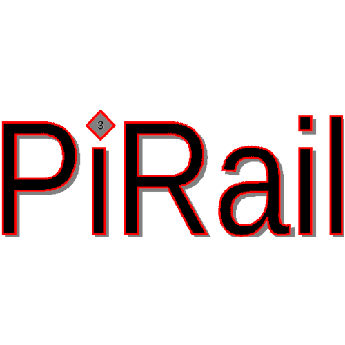

PiRail Data Collection and Analysis
Libraries to create railroad track charts

## Developing

See [Developing.md](docs/Developing.md) for instructions on setting up a development environment, and how to run the project.

## UNH Capstone Project Teams

| Year | Members                                                                                     |
| ---- | ------------------------------------------------------------------------------------------- |
| 2027 | TBD                                                                                         |
| 2026 | Bohdan Barnett, Joshua Beaton, Quinton Center, Zachary Dubuc, Raven Hodgdon, Aidan McErlain |
| 2025 | Logan White, Adam Elsner, Dartagnan Birnie, David Scarborough, Genesis Soebagyo             |
| 2024 | Jay Bazenas, Theo DiMambro, Will Morong                                                     |
| 2023 | Matthew Cusack, Joshua Knauer, Luke Knedeisen                                               |
| 2022 | Ben Grimes, Jeff Fernandes, Max Hennessey, Liqi Li                                          |

## Modules

### [Desktop](desktop/README.md)

Utilities such as converting from PiRail CSV formats to JSON

### [Gps-pi](gps-pi/README.md)

Contains the backend for the PiRail Project

### [Known](known/README.md)

Contains more detailed information about some railways including various landmarks and other defining details.

### [Lidar](lidar/README.md)

Lidar imaging module

### [MachineLearning](MachineLearning/README.md)

Machine Learning Models

### [ReactApp](ReactApp/README.md)

Current frontend for the PiRail project. Ties components together

### [webserver](webserver/README.md)

Old PiRail webserver