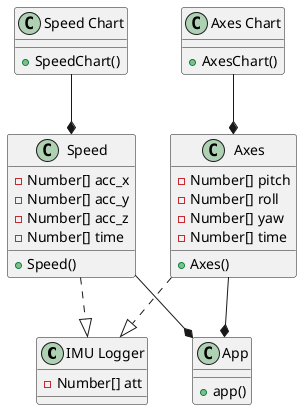
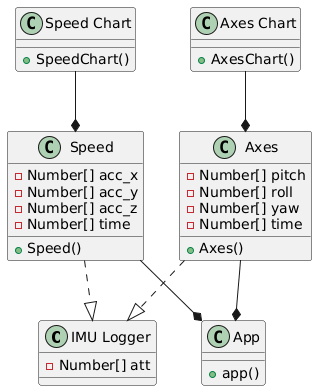
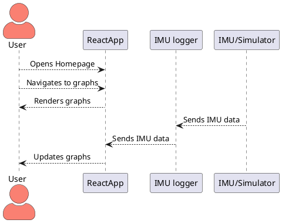
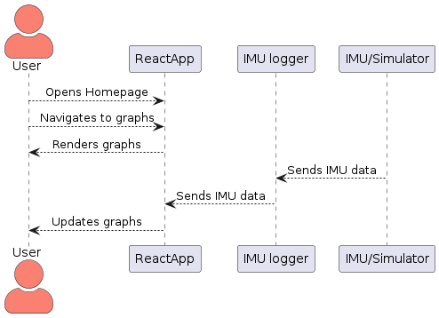

# Class Diagram

```plantuml
@startuml

class "IMU Logger" as Imu_log {
  -Number[] att
}

class App {
+ app()
}

class Axes {
  -Number[] pitch
  -Number[] roll
  -Number[] yaw
  -Number[] time
  +Axes()
}

class "Axes Chart" as Achart {
  +AxesChart()
}

class Speed {
  -Number[] acc_x
  -Number[] acc_y
  -Number[] acc_z
  -Number[] time
  +Speed()
}

class "Speed Chart" as Schart {
  +SpeedChart()
}

App *--u Axes
App *-u- Speed
Axes *-u- Achart
Speed *-u- Schart
Imu_log <|.u. Axes
Imu_log <|.u. Speed

@enduml
```

# Sequence Diagram

```plantuml
@startuml
skinparam actorStyle awesome
skinparam defaultTextAlignment center
skinparam maxMessageSize 150

actor "User" as User #salmon
participant ReactApp
participant "IMU logger" as Imu_log
participant "IMU/Simulator" as Imu_in

User --> ReactApp : Opens Homepage
User --> ReactApp : Navigates to graphs
ReactApp --> User : Renders graphs
Imu_in --> Imu_log : Sends IMU data
Imu_log --> ReactApp : Sends IMU data
ReactApp --> User : Updates graphs
@enduml
```

